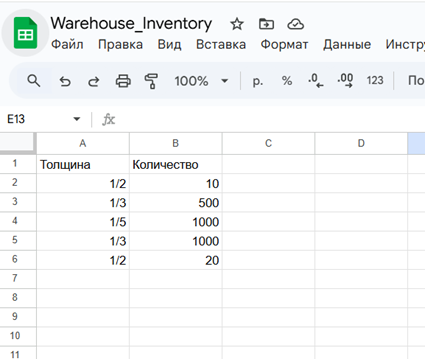
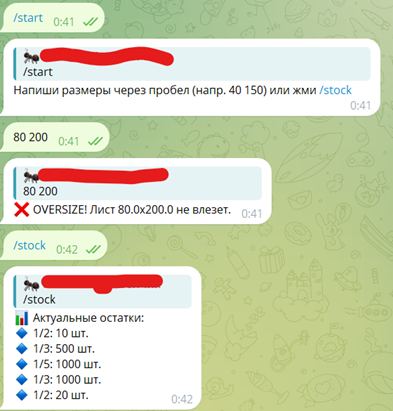

# 📦 Warehouse Inventory & Oversize Validation Bot

## 🎯 Project Overview
This Python-based Telegram bot was developed to automate stock tracking for a glass manufacturing company. It connects to **Google Sheets API** to provide real-time data and includes custom logic for validating product dimensions. 

## 🛠 Features
- **Real-time Stock Updates:** Fetches inventory data from Google Sheets via `/stock` command.
- **Oversize Validation:** Automatically checks if dimensions exceed standard limits (88" x 126").
- **Cloud Integration:** Uses Google Cloud Platform Service Accounts for secure data access.

## 💻 Tech Stack
- **Language:** Python 3.11
- **Libraries:** pyTelegramBotAPI, gspread, oauth2client
- **Database:** Google Sheets API# Supply-Chain-Automation-Bot
Telegram bot for warehouse inventory tracking and glass dimensions validation (Python + Google Sheets API)
